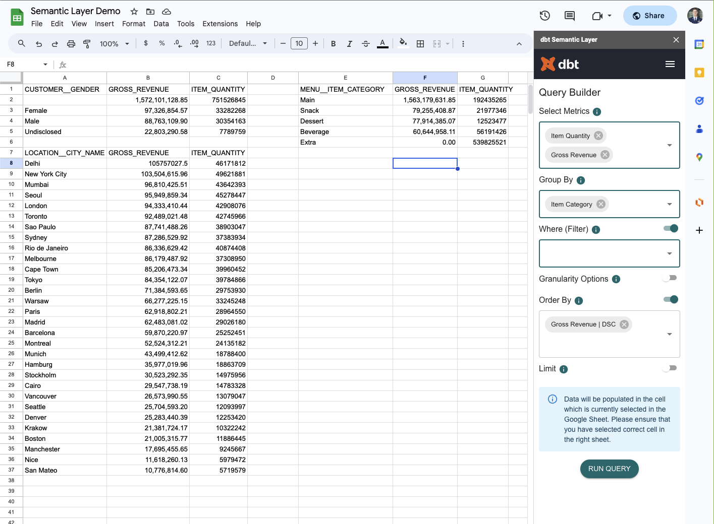
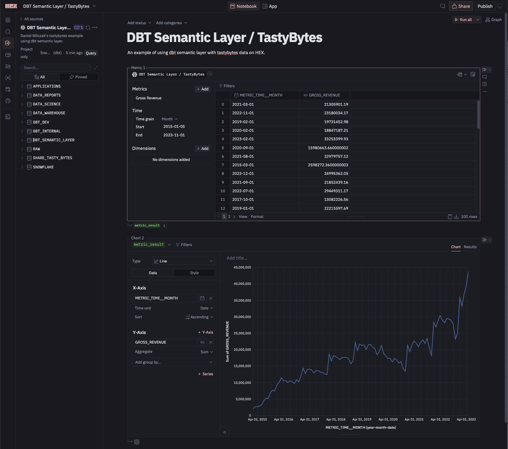

# Dbt-semantic-layer-demo:
Example repo for using dbt semantic layer and snowflake. The demo/repo uses standard [tastybytes](assets/images/tastybytes.png) share we all get from onboarding.

# Demos of using semantic layer:

## Google Sheets:

Link: https://docs.google.com/spreadsheets/d/1CAUjxdAXOhEUxsBAQvYCIr3giVsXieXTEfvr5dPeCz0/edit?usp=sharing

## HEX:

Link: https://app.hex.tech/snowflake/hex/23122fa8-9c72-447a-86c2-0fe01441f193/draft/logic

